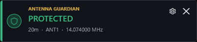
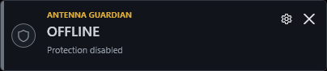
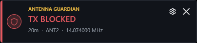
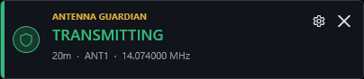
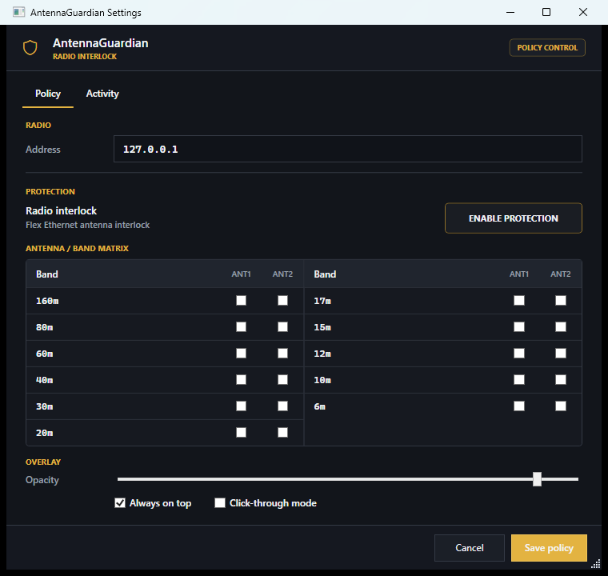

<p align="center">
  
</p>

<h1 align="center">AntennaGuardian</h1>

<p align="center"><strong>A quiet, always-visible antenna safety interlock for Flex radios.</strong></p>

[](https://github.com/johnfking/AntennaGuardian/actions/workflows/build-release.yml)

AntennaGuardian is a compact Windows sidecar that enforces an explicit
antenna-by-band allow matrix through the Flex Ethernet interlock. Because the
decision is enforced at the radio, it applies whether PTT originates in
SmartSDR, SmartSDR CAT, or another client.

For a terminal-only Raspberry Pi or Linux deployment, see
[AntennaGuardianPiLite](https://github.com/johnfking/AntennaGuardianPiLite).

<p align="center">
  
</p>

## At a glance

| Offline | Protected |
| --- | --- |
|  |  |
| **TX blocked** | **Transmitting** |
|  |  |

The overlay stays out of the way, remains movable, can sit above other station
software, and uses color only where it carries operational meaning:

- **Gray:** protection is offline.
- **Green:** the current antenna and band are allowed.
- **Red:** transmit is blocked or a fault requires attention.
- **Amber:** connection or registration is in progress.

Each state includes the radio nickname and current IP address reported through
Flex discovery and the SmartSDR API, making the protected radio unambiguous.

## Policy control



The policy window provides a compact two-row matrix with modern band toggles
for ANT1 and ANT2 across the Flex native amateur bands from 160m through 6m.
Each antenna can also have a custom display name, shown in settings and live
overlay status without changing the underlying Flex antenna identifier.

Window size, overlay position, opacity, always-on-top mode, and click-through
mode are remembered between sessions.

## Safety model

AntennaGuardian is deliberately fail closed:

- Protection is disabled by default on a new installation.
- The default matrix allows no antenna and band combinations.
- Unknown frequency, unknown antenna, out-of-band frequency, and unconfigured
  combinations are denied.
- Connecting registers a dynamic `ANT` interlock and immediately asserts
  `not_ready`.
- `ready` is sent only after an allowed PTT request with a known interlock.
- Unkey, policy changes, and newly forbidden radio context reassert
  `not_ready`.
- An out-of-policy `TRANSMITTING` report becomes a visible fault and reasserts
  `not_ready`.
- Disconnect and cleanup are idempotent, so duplicate shutdown paths cannot
  terminate the application.

Software is an additional guard, not a substitute for the radio's hardware
protection, a correct station configuration, or responsible RF operation.

## Install

1. Open the [latest GitHub Release](https://github.com/johnfking/AntennaGuardian/releases/latest).
2. Download and run `AntennaGuardian-win-x64-Setup.exe`.
3. Open **Settings** from the overlay or tray icon.
4. Select the Flex radio by serial number, IP pin, or direct address and
   configure the antenna/band matrix.
5. Use **ENABLE PROTECTION** when the policy is ready.

The per-user installer does not require administrator access and installs a
Start menu shortcut. AntennaGuardian is self-contained for Windows x64; a
separate .NET installation is not required.

`AntennaGuardian-portable-win-x64.exe` remains available for users who prefer a
single portable file, but portable copies cannot update themselves. Existing
users need to run the installer once to move from the pre-0.2 portable release
to the update-enabled edition. Station settings are retained because they are
stored separately under the user's local application data folder.

Releases are not currently code-signed, so Windows may display a SmartScreen
warning. SignPath Foundation enrollment is in progress; release notes will
identify signed builds once the integration is active.

## Radio discovery

UDP discovery is the recommended connection mode. AntennaGuardian listens for
Flex VITA-49 discovery broadcasts on UDP port 4992 and connects only when a
broadcast matches the configured selector:

- **Serial:** follows the same physical radio if DHCP changes its address.
- **IP pin:** follows the radio at one specific IPv4 address.
- **Serial + IP pin:** requires both values to match.
- **Direct address:** retains the original fixed IP or hostname behavior.

After a discovered radio disconnects, AntennaGuardian returns to listening for
the next matching broadcast. It does not poll the old address. Existing
settings remain in direct-address mode until discovery is selected explicitly.

## Updates

Installed editions check GitHub Releases shortly after startup when automatic
checks are enabled. Update controls are available in **Settings > Updates** and
in the tray menu. Downloads happen without changing radio protection.

Installing an update always requires confirmation. AntennaGuardian refuses to
begin installation while a transmit request is allowing, blocked, transmitting,
or faulted. It saves settings, stops protection cleanly, removes its dynamic
interlock when the connection is available, applies the downloaded package,
and restarts. A failed check or download does not alter protection.

Microsoft Store editions use Store-managed updates instead. They do not query
or apply the GitHub update feed.

## How it works

The application is split into three focused modules:

- `AntennaGuardian.Core` contains the band catalog, explicit allow policy, and
  deterministic guardian state machine.
- `AntennaGuardian.Flex` contains the SmartSDR TCP protocol parser, radio
  adapter, interlock lifecycle, and reconnecting runtime.
- `AntennaGuardian.App` contains the WPF overlay, tray controls, policy editor,
  activity view, and persisted desktop settings.

The controller is the only module that can emit `SetInterlockReady`. Protocol
input is translated into domain events before it reaches that safety boundary.

## Verified behavior

The original bench spike demonstrated that software-originated PTT produced
`PTT_REQUESTED`, the dynamic antenna interlock withheld ready, the radio
reported that the interlock was preventing transmission, and no
`TRANSMITTING` state followed. The interlock was then removed successfully.

See [BENCH_RESULT.md](BENCH_RESULT.md) for the test configuration and evidence
summary. The original one-purpose Python spike remains in
[`antennaguardian_spike.py`](antennaguardian_spike.py).

## Build locally

Prerequisites are the .NET 10 SDK on Windows and the Velopack `vpk` tool when
building an installer.

```powershell
git clone https://github.com/johnfking/AntennaGuardian.git
cd AntennaGuardian
dotnet restore .\AntennaGuardian.sln
dotnet test .\AntennaGuardian.sln -c Release --no-restore
dotnet publish .\src\AntennaGuardian.App\AntennaGuardian.App.csproj `
  -c Release -r win-x64 --self-contained true `
  -p:PublishSingleFile=true -o .\dist
dotnet tool install --tool-path .\.tools vpk --version 1.2.0
.\.tools\vpk pack --packId AntennaGuardian --packVersion 0.3.1 `
  --packDir .\dist --mainExe AntennaGuardian.exe `
  --channel win-x64 --runtime win-x64 --outputDir .\releases
```

## Automated releases

GitHub Actions builds and tests every push and pull request. Every `v*` tag
publishes the installer, full and delta update packages, update-feed metadata,
portable executable, and SHA-256 checksums.

```powershell
git tag v0.3.1
git push origin v0.3.1
```

## Microsoft Store

The Store deployment will use MSIX rather than the existing EXE installer.
Microsoft signs approved MSIX packages and manages their updates, so Store
users do not need a separate code-signing subscription. The packaging work
requires the product identity assigned after reserving AntennaGuardian in
Partner Center. See [Microsoft Store deployment](docs/MICROSOFT_STORE.md).

## Code signing policy

Free code signing provided by SignPath.io, certificate by SignPath Foundation.
The project is preparing its verified GitHub build integration. Until that work
is complete, GitHub releases remain unsigned and say so explicitly.

See the complete [code signing policy](CODE_SIGNING_POLICY.md) and
[privacy policy](PRIVACY.md). Security concerns can be reported privately under
the [security policy](SECURITY.md).

After SignPath approves the project, run the guided enrollment setup from Git
Bash:

```bash
./scripts/setup-signpath.sh
```

## About the author

AntennaGuardian is created and maintained by
[John, W3JFK](https://github.com/johnfking), a former U.S. Air Force
Communications Intelligence specialist and professional software developer for
the past 25 years. John was first licensed in 1995 while stationed in Germany
and operated as **DA4KI** and **DA2KI** for nearly a decade before returning to
the United States.

## License

AntennaGuardian is open-source software available under the
[MIT License](LICENSE). Third-party licensing is listed in
[THIRD_PARTY_NOTICES.md](THIRD_PARTY_NOTICES.md).

## Protocol references

- [SmartSDR TCP/IP API](https://github.com/flexradio/smartsdr-api-docs/wiki/SmartSDR-TCPIP-API)
- [SmartSDR Ethernet interlock](https://github.com/flexradio/smartsdr-api-docs/wiki/TCPIP-interlock)
- [SmartSDR status subscriptions](https://github.com/flexradio/smartsdr-api-docs/wiki/TCPIP-sub)
